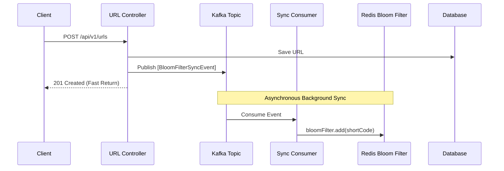
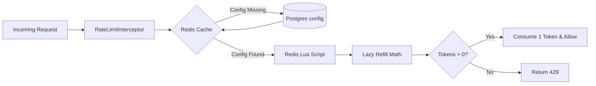
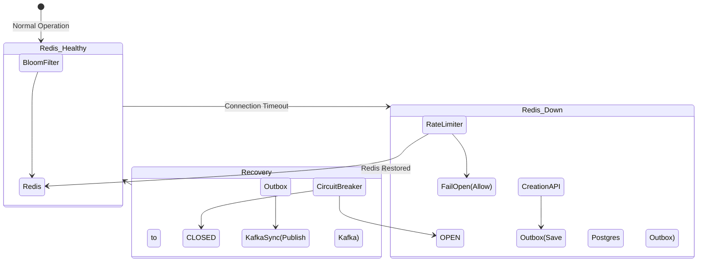

# ThrottleX

ThrottleX is an enterprise-grade, high-throughput, and resilient **Distributed URL Shortener**. Built with modern backend engineering principles, it goes beyond simple CRUD operations to tackle challenges like cache penetration, race conditions in distributed environments, and real-time streaming analytics.

---

## 🚀 Key Features & Architecture Diagrams

### 1. Basic System Overview
This diagram shows the complete lifecycle of a URL Redirection request, from the user clicking the link to the eventual analytics ingestion in ClickHouse.

### 2. Cache Penetration Protection (Distributed Bloom Filter)
Prevents malicious users from spamming the database with non-existent short codes. Uses a Redis-backed `RBloomFilter`, with additions asynchronously synced via an event-driven Kafka pipeline to decouple API latency.

### 3. Atomic Distributed Rate Limiting
A custom Token Bucket rate limiter engineered using a **Redis Lua Script** to ensure lock-free, race-condition-free token consumption. Limits are dynamic (per URL) and fetched from PostgreSQL with aggressive Redis caching.

### 4. Fail-Open Circuit Breakers & Outbox Pattern
Wraps critical infrastructure calls (like Redis) in `resilience4j` circuit breakers. If the caching layer fails, the application gracefully degrades (Fail-Open) to ensure 100% API availability for URL redirections.

---

## 🛠️ Tech Stack

*   **Language:** Java 21
*   **Framework:** Spring Boot 3.x
*   **Database:** PostgreSQL (with manual Fillfactor tuning)
*   **Distributed Cache:** Redis (Lettuce for standard caching, Redisson for advanced structures)
*   **Message Broker:** Apache Kafka (Event-driven tasks and streaming)
*   **OLAP Database:** ClickHouse (Coming soon)
*   **Resiliency:** Resilience4j (Circuit Breakers)

---

## 🏗️ Architecture & Design Patterns

### 1. Event-Driven Distributed Task Queue (Apache Kafka)
Instead of introducing complex external task queue frameworks (like Celery or Sidekiq), **Kafka** acts as the backbone for all background processing, state synchronization, and decoupling. 

**When is this queue used?**
*   **Bloom Filter State Synchronization:** When a new short code is generated, the API responds to the user instantly (in <10ms). In the background, it drops an event into Kafka. The `BloomFilterSyncConsumer` picks it up and updates the Redis Bloom filter, entirely decoupling the heavy network operations from the user request thread.
*   **System Recovery (Outbox Pattern):** If Redis crashes, the application saves new URL creations to a PostgreSQL "Outbox" table. The moment the Circuit Breaker detects Redis has recovered (State transitions to `CLOSED`), the system publishes the Outbox backlog into Kafka. Kafka smoothly queues and streams these updates to the recovered Bloom Filter, preventing a massive CPU spike (thundering herd) during recovery.
*   **High-Volume Analytics (Coming Soon):** Redirection events will be published directly to Kafka, buffering the massive influx of clicks so ClickHouse can comfortably ingest them in large, efficient batches.

**Why is it better?**
*   **Load Buffering:** Kafka absorbs traffic spikes. If the system receives 10,000 URL creations per second, the database is written to quickly, but the Redis cache updates safely at its own pace through Kafka.
*   **Durability & State Handling:** If a worker node crashes mid-sync, the message remains safely in Kafka until a healthy worker consumes it. This guarantees zero data loss and ensures distributed state consistency between PostgreSQL and Redis.

### 2. Interceptor & Strategy Patterns
Rate limiting logic is completely decoupled from the core business controllers. 
*   A Spring `HandlerInterceptor` targets specific API paths (e.g., `GET` redirections).
*   The `RateLimitStrategy` interface and `RateLimiterFactory` allow seamless swapping of throttling algorithms (Token Bucket, Fixed Window) without modifying the interceptor.

### 3. Lazy-Refill Math (Lua)
To prevent crushing the server with background threads trying to refill millions of rate-limit buckets every second, the Token Bucket Lua script uses "Lazy Refill" math. It calculates elapsed time and instantly drops tokens into the bucket *only* at the exact millisecond a user makes a request.

---

## 🚧 Roadmap

- [x] Snowflake Base62 URL Generation
- [x] Redis Read-Through Caching
- [x] Distributed Bloom Filter (Cache Penetration Defense)
- [x] Lua-Scripted Token Bucket Rate Limiting (Dynamic config)
- [ ] Kafka Analytics Producer (Streaming click events)
- [ ] ClickHouse OLAP Integration for real-time dashboards
- [ ] Prometheus & Grafana Observability stack
