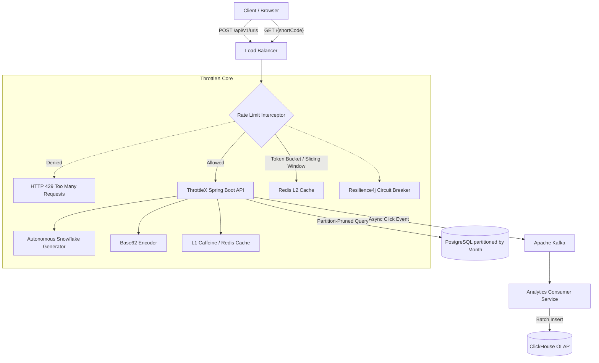

# ThrottleX 🚀

An enterprise-grade, high-throughput URL Shortener and Distributed Rate Limiting engine built for extreme scalability. 

Designed with modern **Domain-Driven Design (DDD)** principles, ThrottleX handles billions of URLs and massive read/write concurrency using a highly optimized PostgreSQL partitioning strategy, autonomous Snowflake ID generation, and an L1/L2 Redis caching layer protected by circuit breakers.

---

## 🏗️ High-Level Design (HLD)

The architecture is explicitly designed to handle heavy read traffic (HTTP 307 Redirects) and high-concurrency writes without creating database bottlenecks.



---

## ⚙️ Scalability Architecture (The Secret Sauce)

ThrottleX does not rely on simple auto-incrementing IDs or basic database queries. It uses a combination of advanced techniques to guarantee $O(1)$ performance even at 10 Billion+ rows.

### 1. Autonomous Snowflake ID Generation
Instead of relying on a centralized Redis counter (which creates a network bottleneck), ThrottleX generates 64-bit IDs purely in-memory using a custom Snowflake algorithm.
- **Node ID Generation:** ThrottleX autonomously hashes the container's MAC/IP address to generate a unique Node ID. It requires zero DevOps configuration or environment variables, making Kubernetes horizontal auto-scaling completely tension-free.
- **Custom Epoch:** Optimized for a 2026 Epoch to maximize the 41-bit timestamp lifespan.

### 2. $O(1)$ PostgreSQL Partition Pruning
PostgreSQL is configured using **Declarative Partitioning (`PARTITION BY RANGE`)** based on monthly boundaries.
- **The Magic:** When a user requests a short URL (e.g., `GET /Xy7bA2`), ThrottleX decodes the Base62 string back into the 64-bit Snowflake ID. 
- Using Bitwise operations (`id >> 22`), the exact millisecond of creation is extracted. 
- The system calculates the absolute start and end of that specific month in **Indian Standard Time (IST)** and passes those boundaries to PostgreSQL.
- **Result:** PostgreSQL completely skips scanning the database and jumps directly to the physical month partition. Read performance remains constant $O(1)$ whether the database has 1 Million or 10 Billion rows.

### 3. Multi-Tier Caching (Caffeine L1 + Redis L2) & Cache Stampede Prevention
To handle 10,000+ reads per second without melting the database, ThrottleX uses a sophisticated **Multi-Tier Caching Architecture**:
- **L1 Cache (Caffeine):** An ultra-fast, in-memory local cache on the JVM. Absorbs the highest velocity traffic instantly without network hops.
- **L2 Cache (Redis):** The distributed cache shared across all API nodes.
- **Cache Stampede Protection (`sync = true`):** If a viral URL expires from the cache, 10,000 requests might hit the database simultaneously (Thundering Herd). ThrottleX solves this by utilizing Spring's `@Cacheable(sync = true)`. This forces threads to wait at the JVM level—only *one* thread is allowed to query PostgreSQL, while the other 9,999 threads wait for the cache to be repopulated, fully protecting the database from I/O spikes.
- **Distributed Bloom Filter (Cache Penetration Protection):** To prevent malicious bots from bypassing the cache by requesting millions of non-existent URLs, ThrottleX leverages a **Redisson Distributed Bloom Filter**. Operating in $O(1)$ time and consuming merely ~119MB of Redis memory for 100 Million URLs, it instantly drops invalid requests before they ever touch the caching layer or PostgreSQL.
- **Resilience4j Circuit Breaking:** To prevent **Cascading Failures** if the Redis cluster experiences an outage, all Redis calls are wrapped in a Circuit Breaker.
  - **OPEN:** If Redis failure rates exceed 50% or latency spikes above 200ms, the circuit trips. It instantly blocks Redis calls and executes a **Fallback Method** (querying PostgreSQL directly) to ensure 100% API uptime.

### 4. Dynamic, Per-URL Rate Limiting Engine (Custom LLD)
Unlike basic global rate limiters, ThrottleX features a hand-written, deeply integrated Domain-Driven Rate Limiting Engine.
- **Per-URL Configuration:** Rate limits are not hardcoded globally. The creator of the Short URL can dynamically configure custom rate limits (e.g., 50 requests/min for URL A, 10,000 requests/sec for URL B) stored in the `RateLimitConfig` entity.
- **Pluggable Algorithms:** The LLD is designed using the Strategy Pattern. Users can select between multiple hand-written algorithms:
  - **Token Bucket:** Extremely fast, great for bursty traffic.
  - **Sliding Window:** Highly accurate, prevents boundary-spike attacks.
- **Atomic Execution:** The algorithms are enforced across distributed nodes using atomic **Redis Lua Scripts**, guaranteeing zero race conditions even at extreme concurrency.

### 5. Asynchronous Analytics Pipeline (Kafka & ClickHouse)
A URL Shortener is essentially an analytics engine disguised as a link router. ThrottleX is built to process tens of thousands of click events per second without ever blocking the user's redirect.
- **Fire-and-Forget Kafka Producer:** When a user hits the `GET` redirect endpoint, the Spring Boot API fires a lightweight, asynchronous JSON event into Apache Kafka using Virtual Threads (`acks=1`). This guarantees that analytics tracking never adds latency to the HTTP 307 Redirect.
- **ClickHouse (OLAP) Database:** The `Analytics Consumer Service` reads batches of events from Kafka and flushes them into **ClickHouse**, a columnar database engineered for extreme speed analytical queries.
- **What We Track:**
  - **URL-Wise Analytics:** Time-series aggregations (clicks per minute/hour/day), Referrer tracking (Social Media, Direct, Email), Geo-location/Country data, and Device/Browser telemetry.
  - **Overall Platform Analytics:** Global traffic volume, unique user tracking, and active URL velocity.
- **Why ClickHouse?** While PostgreSQL is perfect for Transactional (OLTP) URL creation, it would choke trying to sum millions of click events. ClickHouse uses Materialized Views and columnar compression to execute complex `GROUP BY` aggregations on billions of rows in milliseconds.

---

## 📂 Low-Level Design (LLD) & Domain-Driven Structure

ThrottleX strictly adheres to Domain-Driven Design (DDD). There are no global `models` or `repositories` folders. The code is isolated by bounded contexts.

```text
src/main/java/com/throttlex/
├── urlshortener/                 # Bounded Context: URL Shortening
│   ├── controller/               # REST APIs (HTTP 201, HTTP 307)
│   ├── service/                  # Business Logic & Partition Routing
│   ├── entity/                   # JPA Entities (Url)
│   ├── repository/               # Data Access
│   ├── dto/                      # Request/Response objects
│   └── util/                     # Snowflake & Base62 Logic
│
├── ratelimit/                    # Bounded Context: Rate Limiting
│   ├── algorithm/                # TokenBucket, SlidingWindow implementations
│   ├── config/                   # Lua Scripts & Redis Beans
│   ├── entity/                   # RateLimit configurations
│   └── repository/               # DB access for configs
│
└── common/                       # Shared Kernel
    ├── entity/                   # BaseEntity (Timestamps, ID)
    └── exception/                # Global Error Handling
```

---

## 🛠️ Tech Stack

*   **Core:** Java 21, Spring Boot 3.4.1 (Virtual Threads Enabled)
*   **Database:** PostgreSQL 16 (Declarative Partitioning)
*   **Caching & Limiting:** Redis, Lettuce, Caffeine
*   **Resilience:** Resilience4j (Circuit Breaker, Bulkhead)
*   **Analytics Messaging:** Apache Kafka
*   **Connection Pooling:** HikariCP (Optimized for aggressive max-lifetime and fast-fail timeouts)

---

## 🚀 Quick Start (Local Development)

### Prerequisites
*   Java 21 installed
*   PostgreSQL running on port 5432
*   Redis running on port 6379
*   Kafka running on port 9092

### Booting the Application
```bash
# Clone the repository
git clone https://github.com/yourusername/throttlex.git

# Navigate to the service
cd throttlex/service

# Compile and Run
mvn clean install
mvn spring-boot:run
```

### Usage
**Create a Short URL:**
```bash
curl -X POST http://localhost:8080/api/v1/urls \
-H "Content-Type: application/json" \
-d '{"originalUrl": "https://github.com/tarunsharma"}'
```

**Visit the Short URL (HTTP 307 Redirect):**
```bash
curl -v http://localhost:8080/api/v1/urls/Xy7bA2
```
