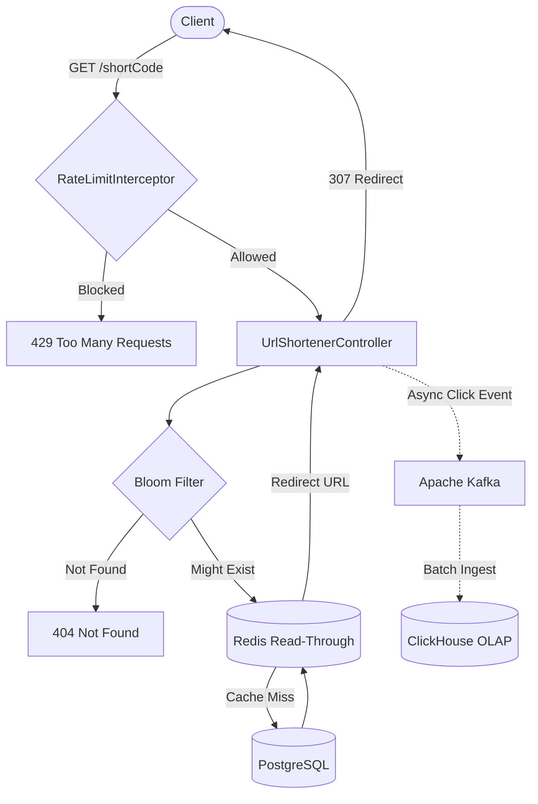
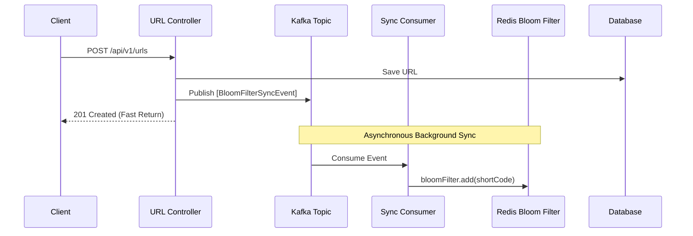
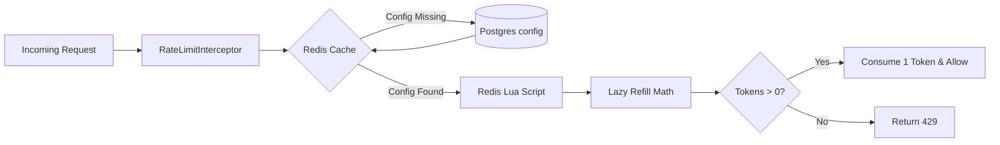
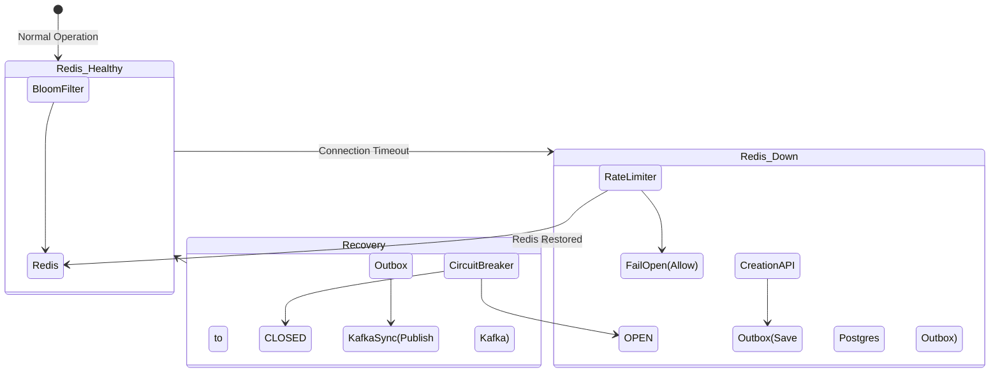
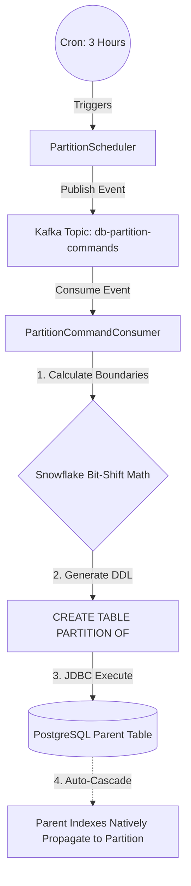

# ThrottleX

ThrottleX is an enterprise-grade, high-throughput, and resilient **Distributed URL Shortener**. Built with modern backend engineering principles, it goes beyond simple CRUD operations to tackle challenges like cache penetration, race conditions in distributed environments, and real-time streaming analytics.

---

## 🚀 Key Features & Architecture Diagrams

### 1. Basic System Overview
This diagram shows the complete lifecycle of a URL Redirection request, from the user clicking the link to the eventual analytics ingestion in ClickHouse.

### 2. Cache Penetration Protection (Distributed Bloom Filter)
Prevents malicious users from spamming the database with non-existent short codes. Uses a Redis-backed `RBloomFilter`, with additions asynchronously synced via an event-driven Kafka pipeline to decouple API latency.

### 3. Atomic Distributed Rate Limiting
A custom Token Bucket rate limiter engineered using a **Redis Lua Script** to ensure lock-free, race-condition-free token consumption. Limits are dynamic (per URL) and fetched from PostgreSQL with aggressive Redis caching.

### 4. Fail-Open Circuit Breakers & Outbox Pattern
Wraps critical infrastructure calls (like Redis) in `resilience4j` circuit breakers. If the caching layer fails, the application gracefully degrades (Fail-Open) to ensure 100% API availability for URL redirections.

---

## 🛠️ Tech Stack

*   **Language:** Java 21
*   **Framework:** Spring Boot 3.x
*   **Database:** PostgreSQL (with manual Fillfactor tuning & Partitioning)
*   **Distributed Cache:** Redis (Lettuce for standard caching, Redisson for advanced structures)
*   **Message Broker:** Apache Kafka (Event-driven tasks and streaming)
*   **OLAP Database:** ClickHouse (Coming soon)
*   **Resiliency:** Resilience4j (Circuit Breakers)

---

## 🏗️ Architecture & Design Patterns

### 1. Advanced Fail-Open Recovery & Outbox Pattern
When distributed cache infrastructure goes down, standard applications fail. ThrottleX is designed to continue handling high-volume writes even when Redis is offline.

**Step-by-Step Failure Handling & Distributed State Resolution:**
1. **Redis Crashes:** The Resilience4j Circuit Breaker transitions to `OPEN`. Rate Limiters default to `Allow` (Fail-Open), and the application continues to accept URL creations.
2. **PostgreSQL Outbox Spooling:** Since we cannot update the Redis Bloom Filter, all new URL creations are saved directly into a PostgreSQL Outbox table. 
3. **Redis Recovers:** The Circuit Breaker detects recovery and transitions to `CLOSED`. The system enters a **"Warmup State"** by setting a global flag directly inside the recovered Redis cluster (`throttlex:bloom:warmup_active`). Because this flag is in Redis, all microservice instances instantly know to bypass the stale Bloom Filter and query Postgres directly to avoid False Negatives.
4. **Kafka Drain:** The system pushes the entire PostgreSQL Outbox backlog into Kafka. Kafka smoothly streams the updates into the Redis Bloom Filter, preventing a massive "thundering herd" CPU spike.
5. **State Restoration:** Once the Kafka Consumer processes the final Outbox message, it simply deletes the `warmup_active` key from Redis. Instantly, all instances detect the key is gone and safely resume normal cache-penetration defense.

### 2. Extreme Database Tuning (PostgreSQL)
To support massive ingestion during Outbox spooling and analytics, the database is heavily tuned:
*   **Asynchronous Event-Driven DDL:** Standard application startup scripts (like Flyway/Liquibase) block the main thread and can crash large microservice deployments if DDL operations on massive tables take too long. ThrottleX uses a background `PartitionScheduler` to publish DDL commands to Kafka. A dedicated consumer runs the `CREATE TABLE PARTITION OF` commands seamlessly in the background, without impacting the application's critical path.

*   **Snowflake ID Monthly Partitioning:** Tables like `urls` and `bloom_filter_outbox` use Snowflake IDs as their Primary Keys. Instead of creating expensive secondary indexes for `created_at` timestamps, ThrottleX natively extracts the creation timestamp directly from the bit-shifted Snowflake ID! This allows for flawless Time-Series Monthly Partitioning strictly using the primary key. Old analytics and outbox data can be instantly dropped via `DROP PARTITION`, bypassing slow `DELETE` locks.
*   **Automated Index Propagation:** In PostgreSQL 11+, defining an index on a partitioned parent table automatically and instantly cascades to all current and future child partitions without requiring manual intervention.
*   **Partial Indexes:** The Outbox table uses a Partial Index (`CREATE INDEX ON outbox(id) WHERE processed = false`). Since 99% of outbox messages are successfully processed, this keeps the active index size incredibly small (fitting entirely in RAM), resulting in lightning-fast lookups for the recovery cron jobs.
*   **Auto-Vacuuming & Fillfactors:** PostgreSQL Auto-vacuum is tuned to automatically squeeze and reclaim index space. Tables utilize custom `FILLFACTOR` settings to enable HOT (Heap-Only Tuple) updates, preventing expensive page-splits during heavy write loads.

### 3. Event-Driven Distributed Task Queue (Apache Kafka)
Instead of introducing complex external task queue frameworks (like Celery or Sidekiq), **Kafka** acts as the backbone for all background processing, state synchronization, and decoupling. 
*   **High-Volume Analytics (Coming Soon):** Redirection events will be published directly to Kafka, buffering the massive influx of clicks so ClickHouse can comfortably ingest them in large, efficient batches.
*   **Durability & State Handling:** If a worker node crashes mid-sync, the message remains safely in Kafka until a healthy worker consumes it. This guarantees zero data loss and ensures distributed state consistency between PostgreSQL and Redis.

### 4. Interceptor & Strategy Patterns
Rate limiting logic is completely decoupled from the core business controllers via a Spring `HandlerInterceptor` targeting specific API paths. The `RateLimitStrategy` interface and `RateLimiterFactory` allow seamless swapping of throttling algorithms.

### 5. Lazy-Refill Math (Lua)
To prevent crushing the server with background threads trying to refill millions of rate-limit buckets every second, the Token Bucket Lua script uses "Lazy Refill" math. It calculates elapsed time and instantly drops tokens into the bucket *only* at the exact millisecond a user makes a request.

---

## 🚧 Roadmap

- [x] Snowflake Base62 URL Generation
- [x] Redis Read-Through Caching
- [x] Distributed Bloom Filter (Cache Penetration Defense)
- [x] Lua-Scripted Token Bucket Rate Limiting (Dynamic config)
- [ ] Kafka Analytics Producer (Streaming click events)
- [ ] ClickHouse OLAP Integration for real-time dashboards
- [ ] Prometheus & Grafana Observability stack
